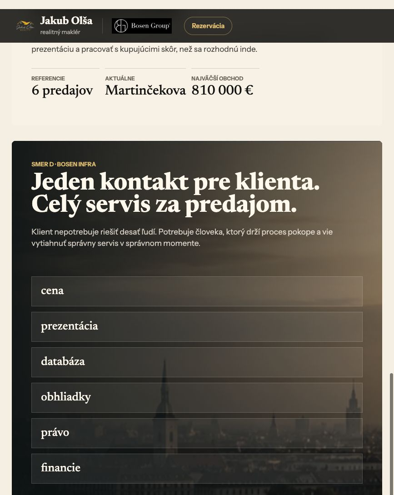
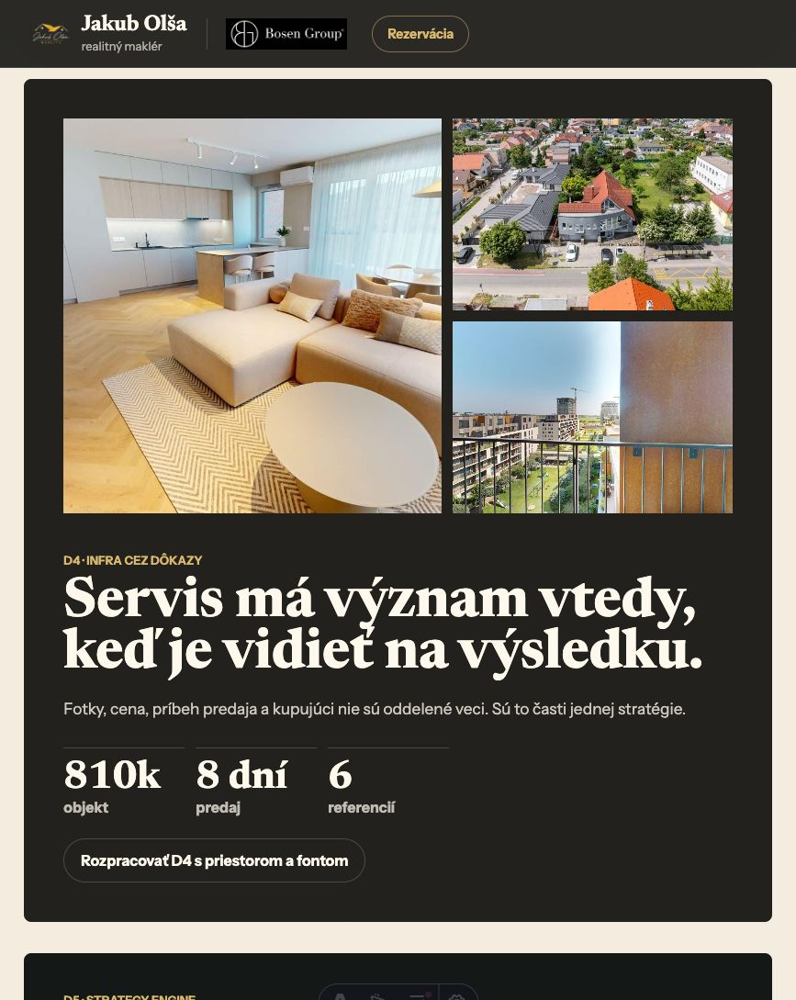
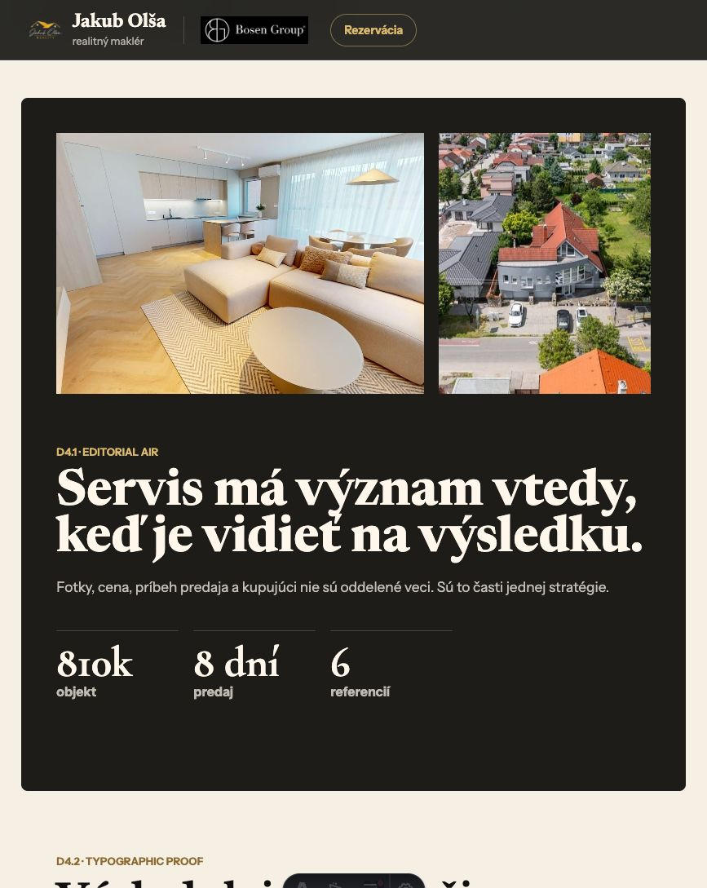

# Archív prototypov

Posledná aktualizácia: 4. jún 2026

Tento priečinok zachováva použiteľné veci z krátkeho prototypovania hero/BOSEN infra smerov. Samotné prototypové route boli odstránené z webu, aby projekt pokračoval v čistom dev režime a staging nebol zaplnený internými experimentmi.

## Čo ostáva použiteľné

### 1. Smer D - BOSEN infra

Screenshot:

Použiteľná myšlienka:

- Jeden kontakt pre klienta.
- Celý servis za predajom.
- BOSEN nie ako dekorácia, ale ako infraštruktúra, ktorú Jakub vie aktivovať.
- Dobré slová pre budúce copy: cena, prezentácia, databáza, obhliadky, právo, financie.

Čo nebrať 1:1:

- Netreba z toho robiť homepage hero hneď teraz.
- Nepotrebujeme interný prototyping board na stagingu.
- Vizuál bol zaujímavý, ale ešte pôsobil ako experiment, nie finálny systém.

### 2. D4 - infra cez dôkazy

Screenshot:

Použiteľná myšlienka:

- Servis má význam vtedy, keď je vidieť na výsledku.
- BOSEN/Jakub servis sa má ukazovať cez dôkaz: fotky, cena, príbeh predaja, kupujúci, rýchlosť, výsledok.
- Toto je silný smer pre sekciu referencií, predaných nehnuteľností alebo case studies.

Čo overiť s Jakubom:

- Ktoré čísla smieme verejne uvádzať.
- Ktorý predaj je najlepší dôkaz BOSEN infra.
- Kde bol konkrétne Jakubov zásah: cena, databáza, vyjednávanie, prezentácia, timing.

### 3. Poznámka z proof boardu - priestor a typografia

Screenshot:

Použiteľná myšlienka:

- Viac negatívneho priestoru robí web prémiovejší.
- Menej textu môže byť silnejšie, ak máme dobré fotky a konkrétne výsledky.
- Typografia môže byť výraznejšia, ale musí zostať čitateľná a použiteľná na mobile.

Čo nebrať 1:1:

- Celý proof board neberieme ako smer.
- Berieme iba princíp: vzduch, silný titulok, dôkazové fotky, konkrétna metrika.

## Rozhodnutie

Prototypovanie bolo užitočné ako ideová sonda, ale nepokračujeme v tom ako paralelnom webe. Ďalší dev režim:

- najprv čistý pôvodný web,
- potom systematický dizajn language,
- potom jeden vybraný komponent/sekcia naraz,
- každý experiment musí mať vstup, výstup a rozhodnutie.
